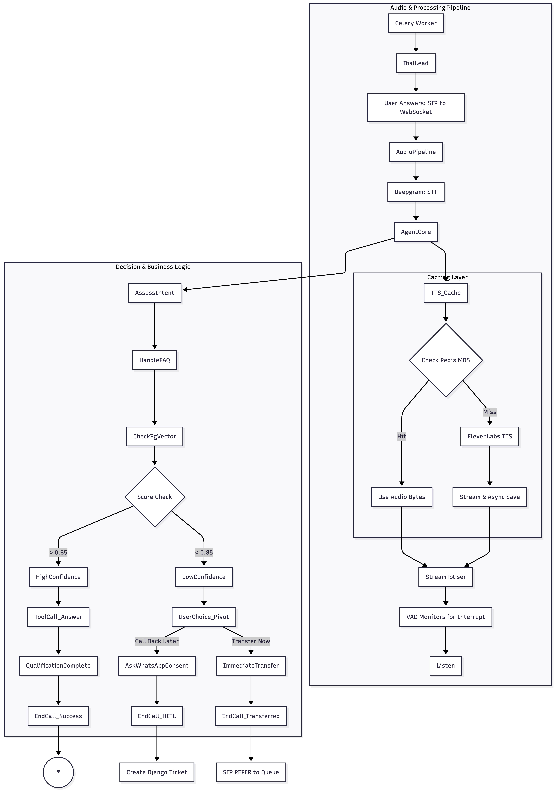
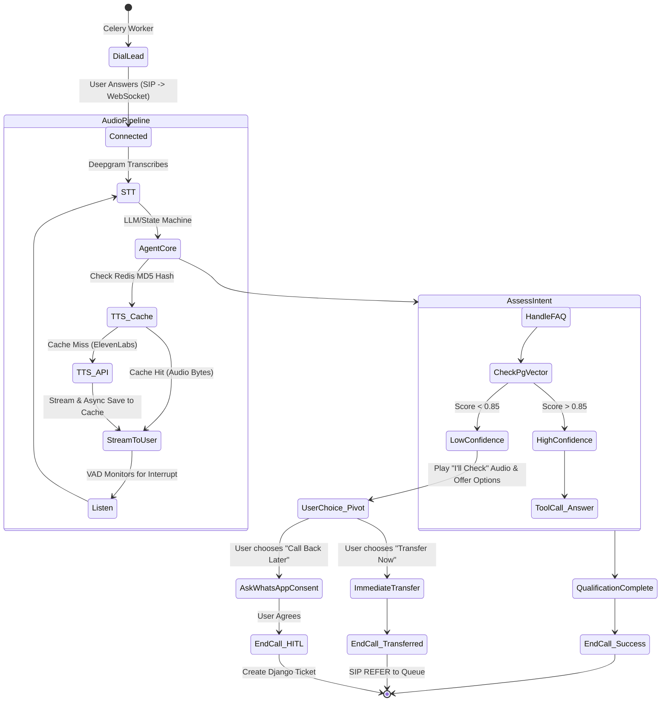

# 6. Activity Diagram: The Conversational State Machine

```mermaid
stateDiagram-v2
    [*] --> DialLead: Celery Worker
    DialLead --> Connected: User Answers (SIP -> WebSocket)
    
    state AudioPipeline {
        Connected --> STT: Deepgram Transcribes
        STT --> AgentCore: LLM/State Machine
        AgentCore --> TTS_Cache: Check Redis MD5 Hash
        
        TTS_Cache --> StreamToUser: Cache Hit (Audio Bytes)
        TTS_Cache --> TTS_API: Cache Miss (ElevenLabs)
        TTS_API --> StreamToUser: Stream & Async Save to Cache
        StreamToUser --> Listen: VAD Monitors for Interrupt
        Listen --> STT
    }
    
    AgentCore --> AssessIntent
    
    state AssessIntent {
        HandleFAQ --> CheckPgVector
        CheckPgVector --> HighConfidence: Score > 0.85
        HighConfidence --> ToolCall_Answer
        
        CheckPgVector --> LowConfidence: Score < 0.85
    }
    
    LowConfidence --> UserChoice_Pivot: Play "I'll Check" Audio & Offer Options
    
    UserChoice_Pivot --> ImmediateTransfer: User chooses "Transfer Now"
    ImmediateTransfer --> EndCall_Transferred
    
    UserChoice_Pivot --> AskWhatsAppConsent: User chooses "Call Back Later"
    AskWhatsAppConsent --> EndCall_HITL: User Agrees
    
    AssessIntent --> QualificationComplete
    QualificationComplete --> EndCall_Success
    
    EndCall_Success --> [*]
    EndCall_Transferred --> [*]: SIP REFER to Queue
    EndCall_HITL --> [*]: Create Django Ticket
```

