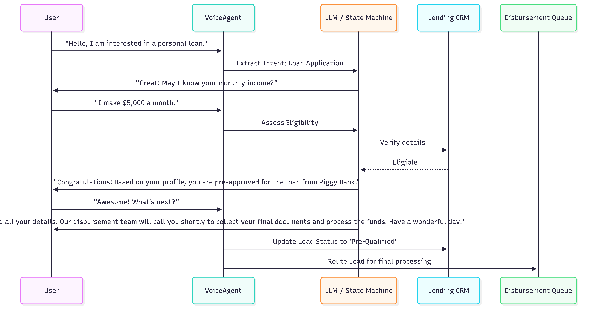
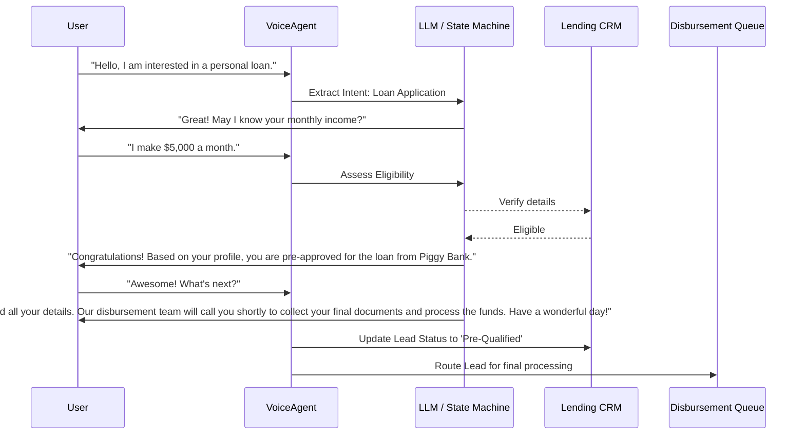
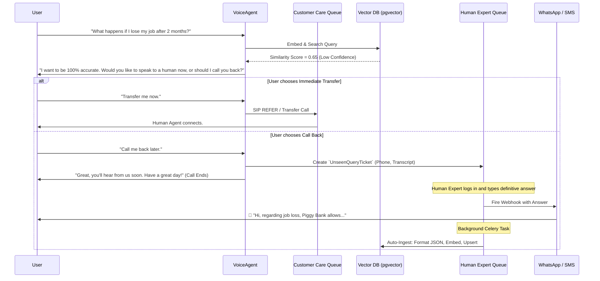
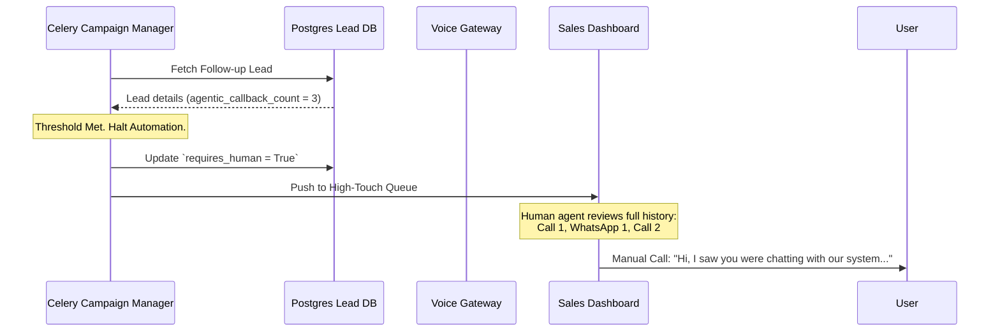

# 7. Multiple Flow Diagrams

### 7.1 The Happy Path (Successful Pre-Qualification)

```mermaid
sequenceDiagram
    participant User
    participant VoiceAgent
    participant AgentCore as LLM / State Machine
    participant CRM as Lending CRM
    participant DisbursementTeam as Disbursement Queue

    User->>VoiceAgent: "Hello, I am interested in a personal loan."
    VoiceAgent->>AgentCore: Extract Intent: Loan Application
    AgentCore->>User: "Great! May I know your monthly income?"
    
    User->>VoiceAgent: "I make $5,000 a month."
    VoiceAgent->>AgentCore: Assess Eligibility
    AgentCore-->>CRM: Verify details
    CRM-->>AgentCore: Eligible
    
    AgentCore->>User: "Congratulations! Based on your profile, you are pre-approved for the loan from Piggy Bank."
    User->>VoiceAgent: "Awesome! What's next?"
    
    AgentCore->>User: "I have recorded all your details. Our disbursement team will call you shortly to collect your final documents and process the funds. Have a wonderful day!"
    VoiceAgent->>CRM: Update Lead Status to 'Pre-Qualified'
    VoiceAgent->>DisbursementTeam: Route Lead for final processing
```

### 7.2 Continuous Learning RAG & HITL Expert Workflow

```mermaid
sequenceDiagram
    participant User
    participant VoiceAgent
    participant LiveAgentQueue as Customer Care Queue
    participant RAG_DB as Vector DB (pgvector)
    participant DjangoAdmin as Human Expert Queue
    participant WhatsAppAPI as WhatsApp / SMS

    User->>VoiceAgent: "What happens if I lose my job after 2 months?"
    VoiceAgent->>RAG_DB: Embed & Search Query
    RAG_DB-->>VoiceAgent: Similarity Score = 0.65 (Low Confidence)
    
    VoiceAgent->>User: "I want to be 100% accurate. Would you like to speak to a human now, or should I call you back?"
    
    alt User chooses Immediate Transfer
        User->>VoiceAgent: "Transfer me now."
        VoiceAgent->>LiveAgentQueue: SIP REFER / Transfer Call
        LiveAgentQueue->>User: Human Agent connects.
    else User chooses Call Back
        User->>VoiceAgent: "Call me back later."
        VoiceAgent->>DjangoAdmin: Create `UnseenQueryTicket` (Phone, Transcript)
        VoiceAgent->>User: "Great, you'll hear from us soon. Have a great day!" (Call Ends)
        
        Note over DjangoAdmin: Human Expert logs in and types definitive answer
        DjangoAdmin->>WhatsAppAPI: Fire Webhook with Answer
        WhatsAppAPI->>User: 💬 "Hi, regarding job loss, Piggy Bank allows..."
        
        Note over DjangoAdmin: Background Celery Task
        DjangoAdmin->>RAG_DB: Auto-Ingest: Format JSON, Embed, Upsert
    end
```

### 7.3 The 3-Strike Escalation Flow

```mermaid
sequenceDiagram
    participant CampaignManager as Celery Campaign Manager
    participant DB as Postgres Lead DB
    participant VoiceAgent as Voice Gateway
    participant HumanQueue as Sales Dashboard

    CampaignManager->>DB: Fetch Follow-up Lead
    DB-->>CampaignManager: Lead details (agentic_callback_count = 3)
    
    Note over CampaignManager: Threshold Met. Halt Automation.
    
    CampaignManager->>DB: Update `requires_human = True`
    CampaignManager->>HumanQueue: Push to High-Touch Queue
    
    Note over HumanQueue: Human agent reviews full history:<br/>Call 1, WhatsApp 1, Call 2
    HumanQueue->>User: Manual Call: "Hi, I saw you were chatting with our system..."
```
