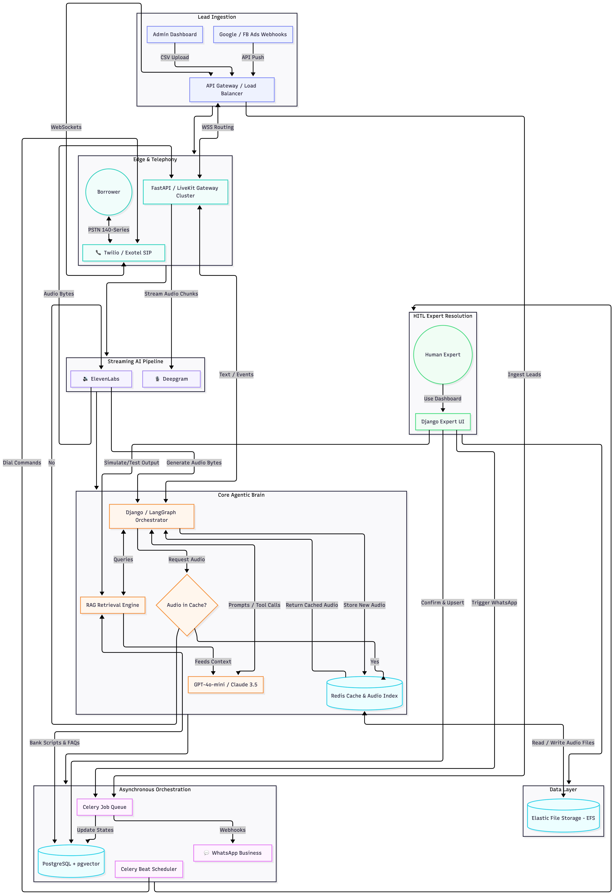
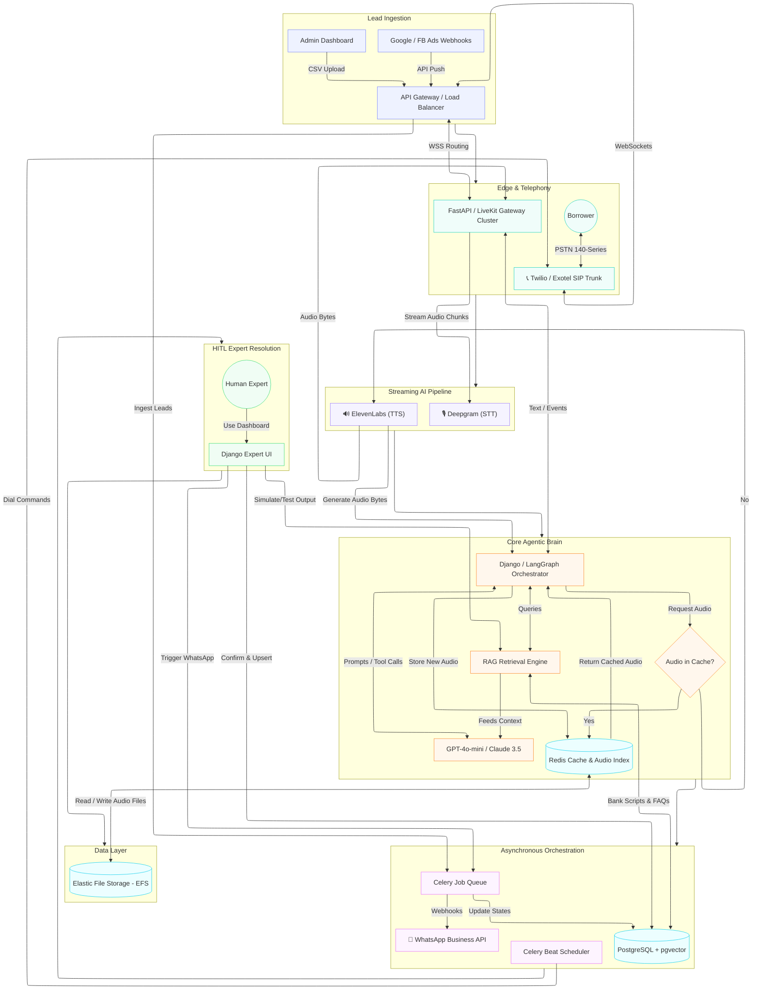

# 8. High-Level Design (HLD) & Infrastructure Details

The architecture decouples the telephony streaming from the backend processing, optimizing for Python/FastAPI asynchronous capabilities while utilizing standard Django toolsets for management, lead ingestion, and the expert resolution dashboard.

### 8.1 System Architecture Diagram

### 8.2 Component Detailing

1. **Lead Ingestion Engine:**
   * **Ad Platform Webhooks:** Real-time webhooks from Facebook Lead Ads or Google Ads hit the API Gateway and are immediately queued by Celery to insert fresh, high-intent leads into PostgreSQL.
   * **Admin Uploads:** Operations staff can manually upload CSV lead sheets via the Django admin panel for targeted campaign dialing.

2. **Load Balancer & Media Gateway Cluster:** 
   * An AWS Application Load Balancer (or NGINX/HAProxy) distributes incoming WebSocket connections from the SIP Provider (Twilio/Exotel) across a horizontally scaling cluster of FastAPI/LiveKit Media Gateway pods. This ensures high availability and prevents CPU bottlenecks during audio processing.

3. **Multi-Tier TTS Caching (Redis + EFS):**
   * To achieve ultra-low latency, the system intercepts LLM text at sentence boundaries and checks Redis for an MD5 hash. Instead of storing heavy raw audio bytes in memory, **Redis acts as a fast lookup index returning a file path**. The Media Gateway then instantly pulls the `.wav` file from **Elastic File Storage (EFS)**—a local network mount shared across all gateway pods. If it's a cache miss, it calls ElevenLabs, streams to the user, and asynchronously saves the file to EFS while updating the Redis pointer.

4. **The Agentic Brain (Django/FastAPI):**
   * Manages the conversation state machine using LangGraph or CrewAI. It holds conversational context, tracks the `agentic_callback_count` escalation triggers, and executes Tool-Calling logic for deterministic RAG retrieval.

5. **HITL Expert Dashboard & Pre/Post Testing Simulator:**
   * When the AI encounters an unseen query and pivots, a ticket is generated in the Expert Dashboard.
   * **Testing Simulator:** The dashboard features a unique testing interface. Before pushing a new canonical answer to the database, the expert types the answer and clicks "Simulate". The dashboard runs the user's original query against the RAG/LLM pipeline in a sandbox, showing the expert exactly how the AI will respond with the new context.
   * **Resolution & Follow-up:** Once satisfied that the AI responds perfectly, the expert clicks "Approve." The system automatically embeds and upserts the knowledge to `pgvector`, triggers the WhatsApp response to the user, and schedules the AI to call the user back to resume the conversation.

6. **Database (PostgreSQL + pgvector):**
   * Acts as the primary transactional datastore for leads and system state, as well as the robust vector database for RAG embeddings.
